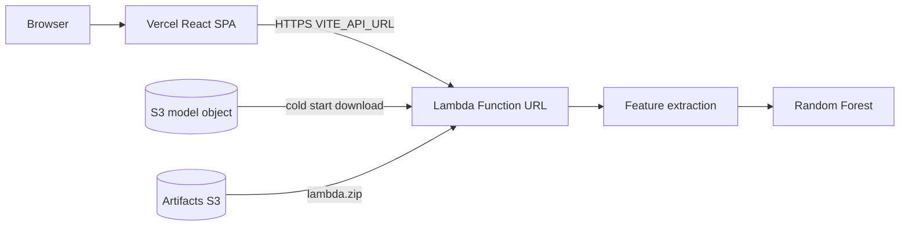

# ECG AI Serverless

I built an end-to-end ECG arrhythmia classifier that runs inference on AWS Lambda and presents results in a React SPA. A Random Forest model scores short single-lead fragments into six rhythm classes, using 22 statistical, HRV, and frequency-domain features extracted at request time.

This is a portfolio project, not a clinical product. The goal was to ship a complete ML path (training, packaging, HTTP inference, UI, infrastructure) under real serverless constraints, then keep the AWS side cheap enough to create and destroy between demos.

[Architecture diagram: Browser → Vercel → Lambda Function URL → S3 model cache]

## Motivation

I wanted to answer a practical question: can a scientific Python inference stack (NumPy, SciPy, scikit-learn) run as a ZIP-deployed Lambda without containers, without always-on compute, and without drifting into a billable demo environment?

That question sat on top of a concrete ML task. Using the PhysioNet ECG Fragment Database for Dangerous Arrhythmia (2022), I trained a multiclass Random Forest on 1,016 labeled fragments and needed a way to expose it through a browser upload flow. The interesting part was not “host a model somewhere.” It was fitting the runtime into Lambda’s deployment limits, choosing an HTTPS surface that stays near free-tier friendly, and making deploy/destroy a one-command operation so the portfolio demo does not leave idle AWS resources behind.

An earlier iteration served the SPA from S3 behind CloudFront with `/api/*` forwarded to the Function URL. I later moved the frontend to Vercel and left AWS responsible only for inference. That simplification is the current architecture.

## Architecture

**Frontend (Vercel).** React 19 + TypeScript + Vite. Upload or “Try a sample” sends base64 `.hea` / `.dat` payloads to `POST /predict`. Charts use uPlot for the waveform and Recharts for probabilities and metrics. TanStack Query and Zod sit on the Axios client.

**Backend (Lambda).** A small HTTP router (`/health`, `/metrics`, `/predict`) on a Function URL (payload format 2.0). CORS is configured on the Function URL itself so the handler does not emit duplicate `Access-Control-*` headers. The model is loaded from S3 into `/tmp` on cold start and reused while the execution environment stays warm.

**Infrastructure (Terraform).** Artifacts bucket, Lambda (Python 3.11, 1024 MB, x86_64), Function URL, IAM, CloudWatch Logs. The trained `joblib` object lives in an external bucket that Terraform references but does not create or destroy. `scripts/deploy.*` builds the ZIP, ensures the model object exists, applies Terraform, and health-checks `{function_url}/health`.

[Screenshot: Analyze page with prediction, waveform, and class probabilities]

## Engineering Decisions

**ZIP Lambda instead of a container image.** I deliberately avoided ECR/container packaging to keep the demo free of registry storage cost. That forced the stack under the 250 MB unzipped ZIP limit and made dependency weight a first-class design constraint.

**Drop `wfdb` and `neurokit2`.** A naive scientific vendoring landed near ~290 MB unzipped. Most of the bloat came from matplotlib (via neurokit2) and the wfdb transitive graph. I replaced them with a format-16-only numpy WFDB reader and a Pan-Tompkins-style R-peak detector on `scipy.signal` (already required by scikit-learn). Feature values changed, so the model was retrained on the new extractor. Package size ended around ~183 MB unzipped / ~57 MB zipped.

**Lambda Function URL instead of API Gateway.** Function URLs provide HTTPS without an extra always-on control plane. API Gateway’s free tier is time-limited on new accounts; for a portfolio demo that may sit idle for months, skipping it mattered more than missing throttling and usage plans.

**Vercel for the SPA, AWS for inference.** After CloudFront + private S3 + OAC proved heavier than needed for this use case, I moved static hosting off AWS. Terraform now owns only the backend. Trade-off: the browser talks cross-origin to the Function URL, so CORS and `VITE_API_URL` become part of the contract.

**S3 staging for the deployment artifact.** At ~57 MB, `lambda.zip` exceeds the ~50 MB direct `CreateFunction` upload limit. Terraform uploads to an artifacts bucket and creates the function from `s3_bucket` / `s3_key`, with `source_code_hash` driven by the local ZIP so updates are reliable.

**Minimal IAM.** The execution role gets CloudWatch logging plus `s3:GetObject` on the single model key (and `GetBucketLocation` on that bucket). No broad S3 wildcards.

## Challenges

**Fitting the scientific stack into Lambda ZIP limits.** Removing heavy libraries was not enough by itself. The build must install manylinux x86_64 / cp311 wheels even when packaging from Windows, flatten imports for the Lambda handler layout, strip boto3/botocore (provided by the runtime), and zip with forward-slash paths. PowerShell’s `Compress-Archive` writes backslashes that Lambda treats as literal names; the Python zip step exists specifically to avoid that.

**Function URL CORS and public invoke permissions.** Listing `OPTIONS` in `allow_methods` fails AWS validation (method string length ≤ 6). Preflight is handled by the Function URL CORS layer. Emitting CORS headers from the handler as well caused browsers to reject responses with duplicate `Access-Control-Allow-Origin`. Separately, AuthType `NONE` needs both `lambda:InvokeFunctionUrl` and `lambda:InvokeFunction` with `InvokedViaFunctionUrl`; missing the second produced HTTP 403 with no CloudWatch logs, which made debugging slow until the permission pair was explicit in Terraform.

**Local vs production model resolution.** Locally, `MODEL_LOCAL_PATH` points at `data/models/random_forest_final.joblib`. In AWS, the same loader downloads from S3 into a temp-dir cache. `test_lambda.py` synthesizes Function URL events so `/health`, `/metrics`, and `/predict` can be exercised without credentials when the local model file is present.

## Results

- Working browser → Vercel → Lambda → model path for classify-and-visualize demos
- Random Forest metrics in `model_metadata.json`: **76.96% accuracy**, **75.6% balanced accuracy** on 1,016 PhysioNet fragments, 6 classes, 22 features
- Deployable Lambda package: ~183 MB unzipped, ~57 MB zipped
- One-command AWS backend deploy/destroy; frontend stays on Vercel and is untouched by `destroy`
- No API Gateway, no CloudFront, no always-on compute in the current AWS footprint

Per-class precision/recall/F1 and the confusion matrix are `null` in the committed metadata until training is re-run with the raw `ECG_DB/` dataset (gitignored, not bundled).

[Metric: accuracy 76.96% / balanced accuracy 75.6%]
[Terminal output: `python test_lambda.py` → `/health`, `/metrics`, `/predict`]

## What I Learned

Serverless ML packaging is mostly dependency economics: what you import decides whether ZIP deploy is viable. Replacing libraries changes features, so training and inference have to share one contract (`FEATURE_COLUMNS`) and be retrained together. Function URLs look simple until CORS ownership and the dual public-invoke permissions show up. Separating SPA hosting from inference IaC made destroy cycles safer: tearing down AWS does not delete the demo UI.

## Future Improvements

- Re-run training with `ECG_DB/` present so `/metrics` can serve per-class scores and a confusion matrix
- Add CI for Lambda package builds and `terraform plan` checks (not in the repo today)
- Refresh frontend architecture copy that still describes the older CloudFront + S3 path; the live infra is Vercel + Function URL
