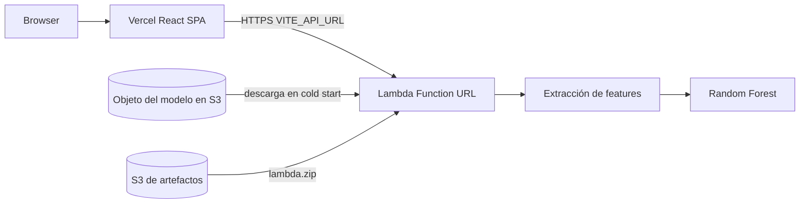

# ECG AI Serverless

Construí un clasificador de arritmias ECG de extremo a extremo: la inferencia corre en AWS Lambda y los resultados se muestran en una SPA React. Un Random Forest evalúa fragmentos cortos de una sola derivación en seis clases de ritmo, a partir de 22 features estadísticas, de HRV y del dominio frecuencial calculadas en cada request.

Es un proyecto de portfolio, no un producto clínico. La meta era cerrar el ciclo completo de ML (entrenamiento, empaquetado, API HTTP, UI e infraestructura) dentro de límites reales de serverless, y dejar el lado AWS lo bastante barato como para crearlo y destruirlo entre demos.

[Diagrama de arquitectura: Browser → Vercel → Lambda Function URL → caché del modelo en S3]

## Motivación

Quería responder una pregunta concreta: ¿se puede servir un stack científico de Python (NumPy, SciPy, scikit-learn) como Lambda empaquetada en ZIP, sin contenedores, sin cómputo siempre encendido y sin que el demo se convierta en un entorno que genere costo permanente?

Esa pregunta se apoyaba en una tarea de ML real. Con el PhysioNet ECG Fragment Database for Dangerous Arrhythmia (2022) entrené un Random Forest multiclase sobre 1.016 fragmentos etiquetados y necesitaba exponerlo con un flujo de carga desde el navegador. Lo interesante no era “subir un modelo a la nube”, sino encajar el runtime en los límites de despliegue de Lambda, elegir una superficie HTTPS compatible con un uso cercano al free tier, y dejar deploy/destroy en un solo comando para que el demo de portfolio no deje recursos AWS ociosos.

Hubo una iteración anterior con la SPA en S3 detrás de CloudFront y `/api/*` reenviado a la Function URL. Después moví el frontend a Vercel y dejé AWS solo a cargo de la inferencia. Esa es la arquitectura actual.

## Arquitectura

**Frontend (Vercel).** React 19 + TypeScript + Vite. La carga o el botón “Try a sample” envía `.hea` / `.dat` en base64 a `POST /predict`. El waveform usa uPlot; probabilidades y métricas, Recharts. TanStack Query y Zod complementan el cliente Axios.

**Backend (Lambda).** Un router HTTP pequeño (`/health`, `/metrics`, `/predict`) sobre Function URL (payload format 2.0). El CORS vive en la Function URL; el handler no debe emitir headers `Access-Control-*` duplicados. El modelo se descarga de S3 a `/tmp` en cold start y se reutiliza mientras el entorno de ejecución sigue caliente.

**Infraestructura (Terraform).** Bucket de artefactos, Lambda (Python 3.11, 1024 MB, x86_64), Function URL, IAM y CloudWatch Logs. El `joblib` entrenado vive en un bucket externo que Terraform referencia pero no crea ni destruye. `scripts/deploy.*` construye el ZIP, asegura el objeto del modelo, aplica Terraform y hace health-check de `{function_url}/health`.

[Captura: página Analyze con predicción, waveform y probabilidades por clase]

## Decisiones de ingeniería

**Lambda en ZIP en lugar de imagen de contenedor.** Evité ECR/contenedores a propósito para no pagar almacenamiento de registry en un demo. Eso obliga a respetar el límite de 250 MB descomprimidos del ZIP y convierte el peso de dependencias en una restricción de diseño.

**Eliminar `wfdb` y `neurokit2`.** Un empaquetado científico ingenuo rondaba ~290 MB descomprimidos. Gran parte venía de matplotlib (vía neurokit2) y del grafo transitivo de wfdb. Los reemplacé por un lector WFDB format-16 mínimo en numpy y un detector de picos R estilo Pan-Tompkins con `scipy.signal` (ya requerido por scikit-learn). Los valores de features cambiaron, así que reentrené el modelo con el extractor nuevo. El paquete quedó en ~183 MB descomprimidos / ~57 MB en ZIP.

**Function URL en lugar de API Gateway.** La Function URL da HTTPS sin un plano de control extra. El free tier de API Gateway es temporal en cuentas nuevas; para un demo de portfolio que puede estar meses sin usarse, evitarlo pesó más que renunciar a throttling y usage plans.

**Vercel para la SPA, AWS para la inferencia.** CloudFront + S3 privado + OAC era más infraestructura de la necesaria para este caso. Saqué el hosting estático de AWS. Terraform solo gestiona el backend. El trade-off: el browser habla cross-origin con la Function URL, así que CORS y `VITE_API_URL` pasan a ser parte del contrato.

**Staging del artefacto en S3.** Con ~57 MB, `lambda.zip` supera el límite de ~50 MB de subida directa en `CreateFunction`. Terraform lo sube a un bucket de artefactos y crea la función con `s3_bucket` / `s3_key`, usando `source_code_hash` del ZIP local para que las actualizaciones sean fiables.

**IAM mínimo.** El rol de ejecución tiene logging en CloudWatch más `s3:GetObject` sobre la key del modelo (y `GetBucketLocation` del bucket). Sin comodines amplios en S3.

## Desafíos

**Meter el stack científico en los límites del ZIP de Lambda.** Quitar librerías pesadas no bastaba. El build tiene que instalar wheels manylinux x86_64 / cp311 aunque se empaquete desde Windows, aplanar imports al layout del handler, eliminar boto3/botocore (ya vienen en el runtime) y zippear con paths en forward slash. `Compress-Archive` de PowerShell escribe backslashes que Lambda interpreta como nombres literales; el zip en Python existe justo para evitar eso.

**CORS de Function URL y permisos de invoke público.** Incluir `OPTIONS` en `allow_methods` falla la validación de AWS (longitud del string de método ≤ 6). El preflight lo resuelve la capa CORS de la Function URL. Si el handler también emite CORS, el browser rechaza la respuesta por `Access-Control-Allow-Origin` duplicado. Además, AuthType `NONE` exige tanto `lambda:InvokeFunctionUrl` como `lambda:InvokeFunction` con `InvokedViaFunctionUrl`; sin el segundo aparecía HTTP 403 sin logs en CloudWatch, y el diagnóstico fue lento hasta dejar el par de permisos explícito en Terraform.

**Resolución del modelo en local vs producción.** En local, `MODEL_LOCAL_PATH` apunta a `data/models/random_forest_final.joblib`. En AWS, el mismo loader descarga desde S3 a un cache en el directorio temporal. `test_lambda.py` sintetiza eventos de Function URL para ejercitar `/health`, `/metrics` y `/predict` sin credenciales cuando el modelo local está presente.

## Resultados

- Camino operativo browser → Vercel → Lambda → modelo para demos de clasificación y visualización
- Métricas del Random Forest en `model_metadata.json`: **76,96% de accuracy**, **75,6% de balanced accuracy** sobre 1.016 fragmentos de PhysioNet, 6 clases, 22 features
- Paquete Lambda desplegable: ~183 MB descomprimidos, ~57 MB en ZIP
- Deploy/destroy del backend AWS en un comando; el frontend en Vercel no lo toca `destroy`
- Sin API Gateway, sin CloudFront y sin cómputo siempre encendido en el footprint AWS actual

Precision/recall/F1 por clase y la matriz de confusión quedan en `null` en los metadatos versionados hasta reentrenar con el dataset crudo `ECG_DB/` (en `.gitignore`, no va en el repo).

[Métrica: accuracy 76,96% / balanced accuracy 75,6%]
[Salida de terminal: `python test_lambda.py` → `/health`, `/metrics`, `/predict`]

## Qué aprendí

Empaquetar ML en serverless es, en buena parte, economía de dependencias: lo que importas decide si el deploy por ZIP es viable. Cambiar librerías cambia features, así que entrenamiento e inferencia deben compartir un contrato (`FEATURE_COLUMNS`) y reentrenarse juntos. Las Function URLs parecen simples hasta que aparecen la propiedad del CORS y el par de permisos de invoke público. Separar el hosting de la SPA del IaC de inferencia hizo más seguros los ciclos de destroy: bajar AWS no borra la UI del demo.

## Mejoras futuras

- Reentrenar con `ECG_DB/` presente para que `/metrics` sirva scores por clase y matriz de confusión
- Añadir CI para builds del paquete Lambda y chequeos de `terraform plan` (hoy no hay workflows en el repo)
- Actualizar el copy de arquitectura del frontend que todavía describe CloudFront + S3; la infra real es Vercel + Function URL
